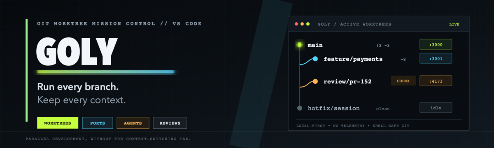

<p align="center">
  <a href="https://marketplace.visualstudio.com/items?itemName=goly-dev.goly"></a>
  <a href="https://marketplace.visualstudio.com/items?itemName=goly-dev.goly"></a>
  <a href="https://github.com/Anse-dev/goly"></a>
  <a href="LICENSE"></a>
</p>

<p align="center"><strong>Stop switching branches. Run them side by side.</strong></p>

Goly turns Git worktrees into a focused mission-control view inside VS Code. Create parallel workspaces, see what is running in each one, isolate reviews, and return to the right coding context without branch-switching gymnastics.

<p align="center">
  <a href="https://marketplace.visualstudio.com/items?itemName=goly-dev.goly"><strong>Install from the VS Code Marketplace →</strong></a>
</p>

## Your repository is parallel. Your tools should be too.

Modern development rarely happens on one branch at a time. A feature is in progress, a production fix arrives, a PR needs review, and a coding agent is still working in another directory.

Goly keeps those lanes visible:

```text
● main                 ↑2  ~3   :3000
● feature/payments         ~8   :3001  ◈ Agent
● review/pr-152                  :4173  ◈ Agent
```

No hidden terminals. No mystery ports. No “which folder was that agent using?” moment.

## One cockpit, six jobs

| Capability | What Goly gives you |
| --- | --- |
| **Worktree control** | Create, open, inspect, and safely remove Git worktrees from the Activity Bar. |
| **Live branch status** | See ahead/behind counts plus staged, modified, and untracked files at a glance. |
| **Port awareness** | Discover listening ports by worktree and surface collisions before they waste your time. |
| **Agent presence** | Detect common coding-agent processes in each workspace. |
| **Review lanes** | Fetch a branch or PR ref into an isolated review worktree, then clean it up in one command. |
| **Context snapshots** | Restore open files, editor columns, terminal locations, and scoped breakpoints. |

## A faster parallel workflow

```text
Create worktree
      ↓
Copy local environment files
      ↓
Optionally run confirmed setup commands
      ↓
Open a clean VS Code window
      ↓
Monitor branch + ports + agents from Goly
```

For reviews:

```text
Fetch ref → isolated review branch → new window → review → cleanup
```

## Get started in 30 seconds

1. Install **Goly** from the [VS Code Marketplace](https://marketplace.visualstudio.com/items?itemName=goly-dev.goly).
2. Open a Git repository.
3. Select the **Goly** icon in the Activity Bar.
4. Click **+** to create a worktree, or right-click an existing one for actions.

You can also open the Command Palette and run `Goly: Create Worktree`.

## Commands

| Command | Shortcut | Purpose |
| --- | --- | --- |
| `Goly: Refresh` | <kbd>Cmd/Ctrl</kbd>+<kbd>Shift</kbd>+<kbd>G</kbd> <kbd>R</kbd> | Refresh worktrees and activity |
| `Goly: Create Worktree` | <kbd>Cmd/Ctrl</kbd>+<kbd>Shift</kbd>+<kbd>G</kbd> <kbd>N</kbd> | Create a workspace from a new or existing branch |
| `Goly: Review Branch/PR` | — | Start an isolated review session |
| `Goly: End Review Session` | — | Remove the review worktree and temporary branch |
| `Goly: Save Snapshot` | — | Capture the current coding context |
| `Goly: Restore Snapshot` | — | Reopen a saved context |
| `Goly: Copy Environment Files` | — | Copy configured local environment files |
| `Goly: Compare with Main` | — | Open a branch diff against the main worktree |

## Configuration

Goly ships with useful defaults and stays out of the way when you do not need automation.

```json
{
  "goly.baseDirectory": "~/workspaces",
  "goly.autoRefresh": true,
  "goly.refreshInterval": 15000,
  "goly.autoOpenInNewWindow": true,
  "goly.confirmBeforeDelete": true,
  "goly.confirmBeforeDeleteBranch": true,
  "goly.envFilePatterns": [".env", ".env.local", ".env.*"],
  "goly.postCreateCommands": [],
  "goly.confirmBeforePostCreateCommands": true,
  "goly.maxWorktrees": 0
}
```

Add commands to `goly.postCreateCommands` only when you want setup automation. Goly asks before running them by default. Set `goly.maxWorktrees` to `0` for unlimited worktrees.

## Built for local-first development

- **No Goly account**
- **No cloud service**
- **No telemetry**
- **No source-code upload**

Git operations and process inspection happen on your machine. Configured post-create commands only run in trusted VS Code workspaces and require confirmation by default.

## Requirements

- VS Code 1.100 or newer
- Git available on your `PATH`
- macOS, Linux, or Windows

Port and process visibility depends on the permissions provided by your operating system.

## Open source

Goly is MIT licensed. Issues and contributions are welcome:

- [Report a bug](https://github.com/Anse-dev/goly/issues)
- [Read the changelog](CHANGELOG.md)
- [Contribute](CONTRIBUTING.md)

```bash
git clone https://github.com/Anse-dev/goly.git
cd goly
npm ci
npm run check
```
